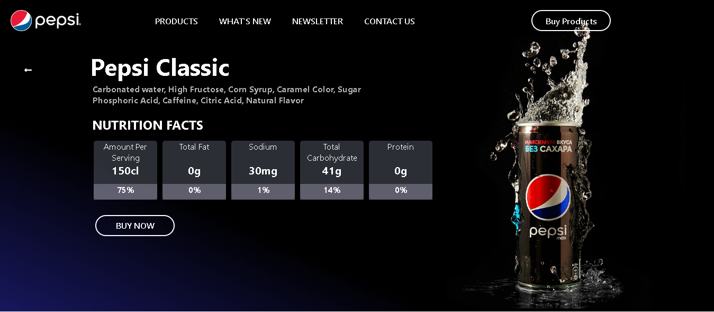

# Pepsi Landing Page

A modern and responsive landing page concept for **Pepsi**, built with React.  
This project focuses on sleek UI/UX design, interactivity, and brand-themed visuals.

---

## Features
- Fully responsive design (mobile-first).
- Interactive animations and hover effects.
- Clean component-based React structure.
- Brand-inspired color palette and typography.

---

## Tech Stack
- **React.js** – Component-based UI
- **CSS3** – Styling
- **JavaScript (ES6+)** – Logic and interactivity

---

##  Project Structure
Pepsi-Landing/
├── public/ # Static files (images, icons, etc.)
├── src/ # React components and styles
│ ├── components/ # Reusable UI elements
│ ├── App.js # Main entry
│ └── index.js # React DOM render
├── package.json # Project dependencies
└── README.md # Project documentation


---

##  Getting Started
1. Clone the repository:
   ```bash
   git clone https://github.com/yourusername/pepsi-landing.git
npm install
npm start

📸 Preview

 

📌 Future Improvements

Add dark mode toggle

Integrate GSAP animations for advanced transitions

Multi-language support

Author

Crystal Obidike
Passionate about building clean, modern, and interactive web experiences.
Portfolio | LinkedIn
